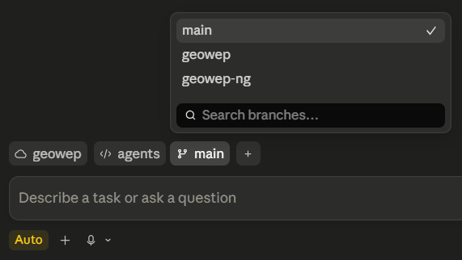
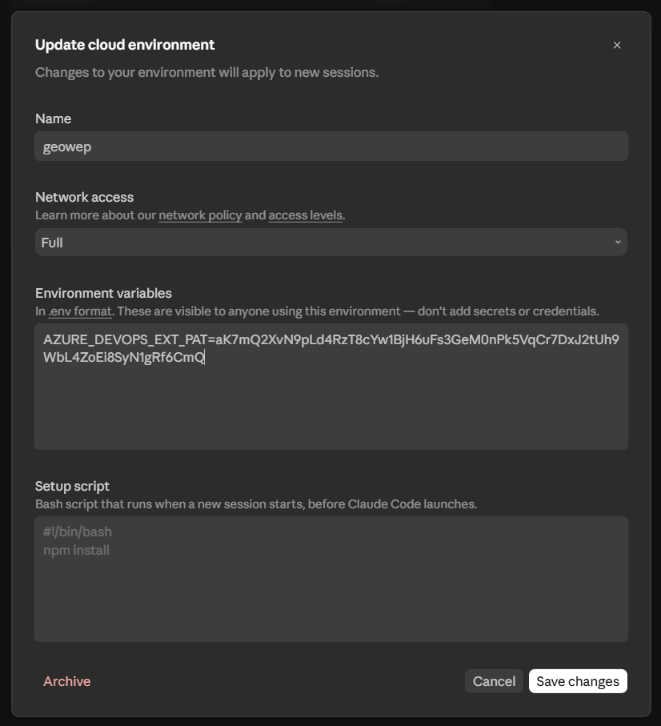

# agents

Launching platform for cloud sessions of AI coding agents.

This repo is **not** a project codebase — it is the place you start a
[Claude Code Web](https://claude.ai/code) session _from_. When a session starts
here, a [session-start hook](.claude/hooks/session-start.sh) clones the **actual
project repo** you want to work on into [src/](src/) (git-ignored), runs its
setup, and mirrors that project's agent settings and instructions back into this
repo so they accumulate and improve over time.

**The main point: it lets you run Claude Code Web/Cloud sessions against repos
Anthropic can't reach directly — notably Azure DevOps.** Anthropic provides a
GitHub App that enables Web sessions on GitHub repos, but there is no equivalent
Azure DevOps app (yet). So this launcher lives on GitHub — where Web _does_ work
— and clones the real project repo (ADO or otherwise) into [src/](src/) using a
PAT, bringing it into reach of a Web session.

One consequence: Claude Web only reads agent config from the launcher repo it
boots into, not from the cloned [src/](src/) project. So the project's (and
component's) AI config — `CLAUDE.md`, `.claude/`, agents, MCP, etc. — has to be
synced _into_ this repo for Web to see and use it. That sync is exactly what the
session-start hook does (see below).

## How it works

When a Claude Code Web session starts on a branch of this repo, the
[session-start hook](.claude/hooks/session-start.sh):

1. Reads the target project from variables at the top of the hook
   (`AGENTS_GIT_ACCOUNT`, `AGENTS_GIT_REPO`, and optionally
   `AGENTS_COMPONENT_DIR` for a monorepo component). **You set these yourself** —
   edit them in [session-start.sh](.claude/hooks/session-start.sh) on each
   project/component branch so the branch points at the right repo (and
   component); they are committed there and are what make the branch
   project/component-specific.
2. Clones (or fast-forward pulls) that repo into [src/](src/) using the PAT from
   the environment (`GITHUB_PERSONAL_ACCESS_TOKEN` or `AZURE_DEVOPS_EXT_PAT`).
3. Runs the per-project setup steps — [PROJECT.sh](.claude/hooks/session-start/PROJECT.sh)
   at the repo root and [COMPONENT.sh](.claude/hooks/session-start/COMPONENT.sh)
   in the component dir (e.g. `npm ci`, version pinning).
4. On Azure DevOps, installs the `az` CLI + `azure-devops` extension in the
   background so PRs can be opened.
5. [Mirrors agent settings](.claude/hooks/session-start/scripts/merge-agent-settings.sh)
   from the cloned project (its `.claude/settings.json`, `.mcp.json`,
   `.claude/agents/`, `.agents/`, `.github/`, and `CLAUDE.md`) into this repo,
   then commits and **pushes them to the project's settings branch** so the next
   session for that project picks them up automatically. The mirror is
   authoritative each run (removals in the source propagate), and the launcher's
   own scaffolding is re-injected afterward so regeneration keeps working. A run
   with no changes produces no commit.

## Branch hierarchy: pick the project (and component) when you start

You choose **which project a session drives by choosing a branch** in the Claude
Code Web branch picker. Each branch carries its own
[session-start hook](.claude/hooks/session-start.sh) configuration plus that
project's mirrored settings:



- **`main`** — the base scaffolding template. Not tied to any project.
- **PROJECT branch** (e.g. `geowep`) — configured for a whole repo. Derived from
  the lowercased repo name. Carries the mirrored _root_ settings.
- **COMPONENT branch** (e.g. `geowep/ng`) — configured for one component of a
  monorepo. Named `<project>/<component>`. Carries the root settings with the
  component's settings layered on top.

The settings branch name is derived automatically from the project identity
(`AGENTS_GIT_REPO` lowercased, plus the last path segment of the component dir),
or set explicitly via `AGENTS_SETTINGS_BRANCH`. To onboard a new project or
component, branch from `main`, set the project variables in the hook, and start a
session on it — the first run populates the branch.

This gives you a tree like:

```
main
├── geowep              # GeoWEP repo, whole
│   └── geowep/ng       # GeoWEP "ng" component
└── <next-project>
    └── <next-project>/<component>
```

## Set your PAT in the cloud Environment

The clone and the PRs authenticate with a Personal Access Token read from the
session's environment variables. Set it in the Claude Code Web **Environment**
config (Settings → cloud environment → _Environment variables_, in `.env`
format):

- GitHub: `GITHUB_PERSONAL_ACCESS_TOKEN=...`
- Azure DevOps: `AZURE_DEVOPS_EXT_PAT=...`



Because the PAT is what scopes access to a given project's repo, you typically
keep **one Environment per project** (e.g. an environment named `geowep` holding
the GeoWEP PAT) and select it alongside the project's branch when starting a
session. These values are visible to anyone using the environment — they are
project-scoped access tokens, not personal secrets to be shared casually.

## Two repos, two git workflows

A session juggles two repos at once. Keep their git workflows separate (this is
also spelled out in [CLAUDE.md](CLAUDE.md)):

|                  | This repo (`agents`, workspace root)                                            | The project repo ([src/](src/))                                 |
| ---------------- | ------------------------------------------------------------------------------- | --------------------------------------------------------------- |
| Holds            | Agent scaffolding + mirrored settings                                           | The actual code you're working on                               |
| Where edits land | The project's **settings branch**, committed & pushed automatically by the hook | A **new branch named after the session**, or an existing feature branch |
| PRs              | n/a (settings are auto-pushed)                                                  | Open a PR from the session branch, or push onto an existing one         |

The agent handles the project-repo branch and PR itself per the rules in
[CLAUDE.md](CLAUDE.md); as a developer you just review and merge the resulting
PR.

Your **starting prompt** decides which of the two project-repo routes applies:

- **A new topic** — a bug to fix or a feature to build (e.g. "fix the legend
  overflow on the print page") — starts fresh: the agent creates a **new branch
  named after the session** and, optionally, opens a PR from it.
- **Continuing an existing feature branch** — e.g. "work on the `map-print`
  feature branch" — checks out that branch instead of creating one, and commits
  and pushes directly to it. If it already has a PR, the push just adds to that
  PR; no new one is created.
